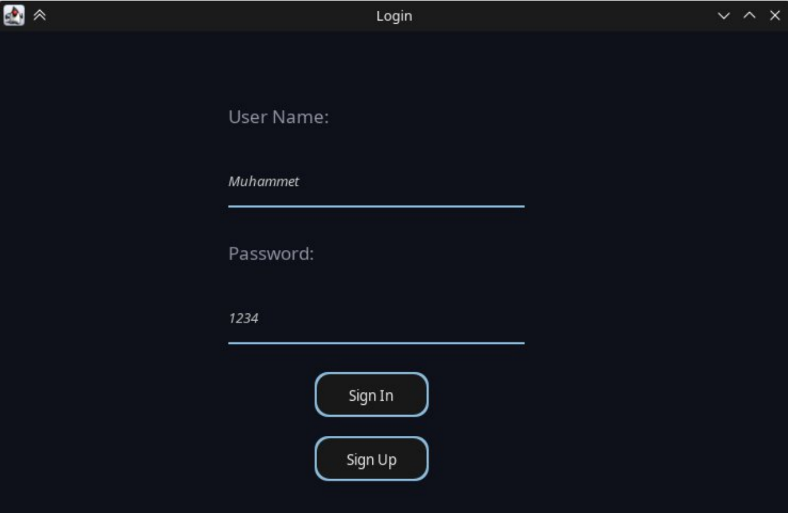
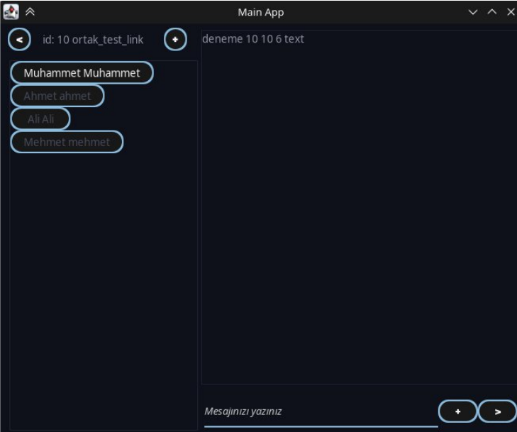
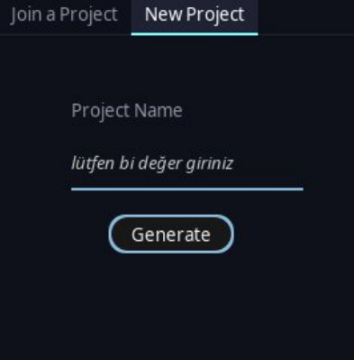

# server_chat_app

Bu projede bizden istenen birden çok alıcı(client) haberleşmesi sunucu(server) üzerinden
gerçekleştirilmesi istenmiştir. Bu doğrultuda bir çok alt görev kod içerisinde gerekli olması durumuna
göre parçalanmıştır. Birden çok kullanıcı hem kendi projeleri içinde haberleşilirken hem de aynı
proje içinde özelden de mesajlaşabilmektedirler. Ek olarak aralarında dosya gönderimi de
sağlanabilmektedir. Emoji desteği java swing kısıtlı olarak destek vermesinden belli emojiler için
gerçekleşmektedir.

Yazılım mimarisi yönünden sunucu ve kullanıcılar arasında haberleşme için Mediator Pattern
kullanılmaya çalışılmıştır. 

- Kullanıcıların, projelerin, mesajların her biri kendi objeleri oluşturularak olabildiğince kod karmaşasının önüne geçilmeye çalışılmaya çalışılmıştır. 
- Bunun haricinde projede
kullanıcılar ile sucu arasında haberleşme json ile yapılmaya çalışılıp tüm işlemler birbirinden ayrılmaya çalışılmıştır. Sonuç olarak sunucuya gönderilen json verisi parçalanıp(pars edilip) geriye sonucu
döndürülmeye çalışılmıştır. 
- Geriye döndürülen veriyi Client sınıfı algılayıp kendisine gönderilen
Consumer \<String\> türünde bir çalıştırıcı fonksiyonu çağırıp çalıştırılması denenmiştir.  
- Böylece arayüzdeki işlemleri tetiklenmesi ve sürekli bir theread içinde dinleme yerine event mantığı ile işlemler yapılmaya çalışılmıştır. Bunların haricinde tüm veriler veri tabanı içinde tutulmaya
çalışılmıştır. 
- Mesajlar ilk bağlandığında hepsi gelmektedir . Yeni bir mesa geldiğinde ise tekrar veri tabanına yazıp tüm veriyi göndermektense sadece yeni mesaj kullanıcıya gönderilmeye çalışılmıştır.
- Bunlara ek olarak Doysa gönderme için yeni bir port üzerinde sunucu başlatılıp her kullanıcı kendisinde dosya için dosya sunucuna bağlanılması sağlanmıştır. 
- Bu durumda dosya gönderme durumunda sistem tıkanmayıp işlemlerin devam etmesi sağlanmıştır.